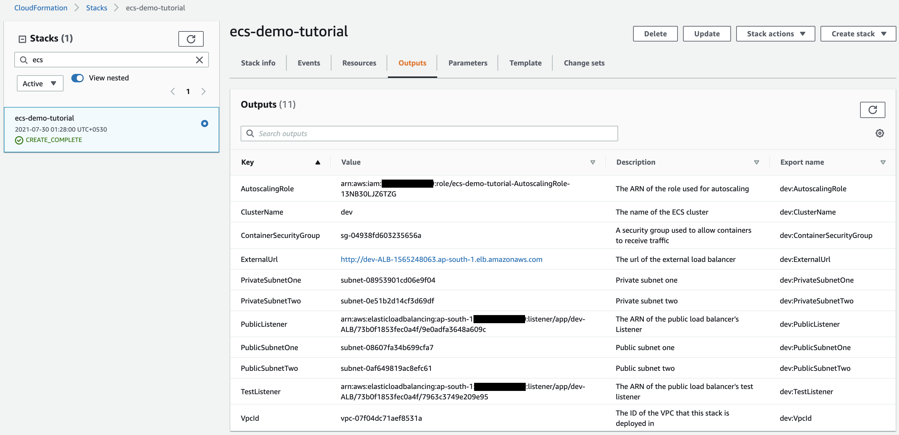
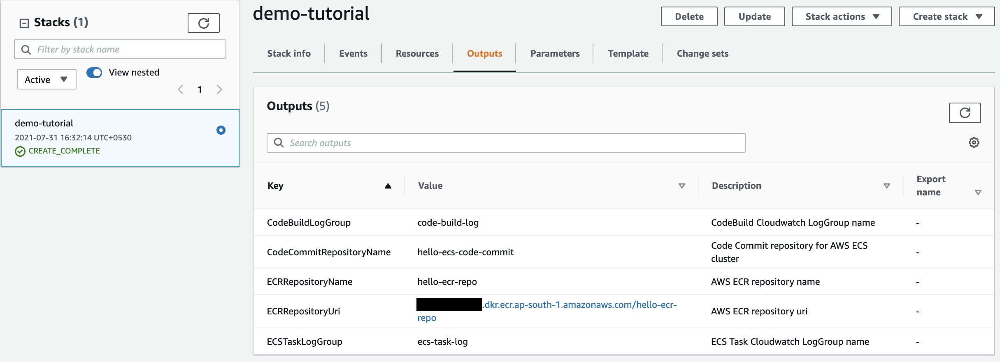
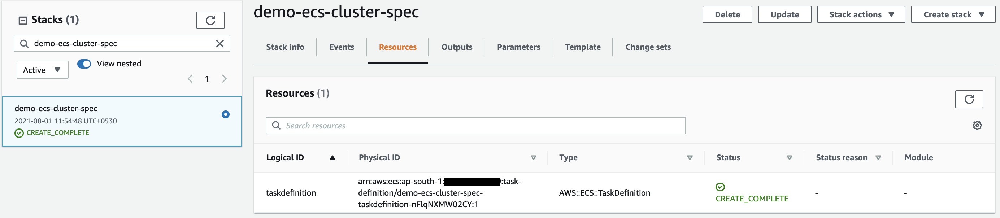
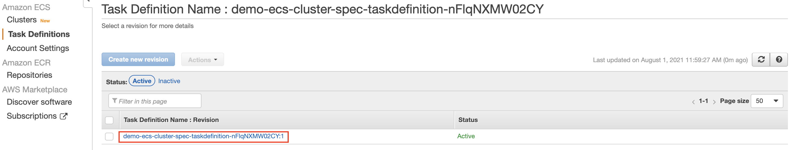
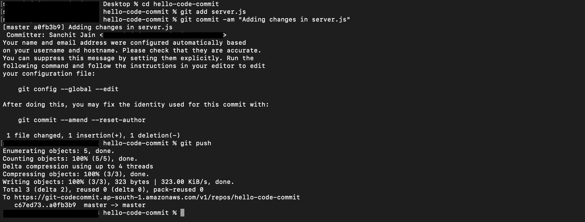

## Rolling Update In AWS ECS

**Overview**

  1. What is AWS ECS?

      - Amazon Elastic Container Service (Amazon ECS) is a fully managed container orchestration service that offers simplfied deploy, manage, and scale containerized applications. It deeply integrates with the rest of the AWS platform to provide a secure and easy-to-use solution for running container workloads in the cloud.

      - Amazon ECS are a particularly attractive delivery vehicle for CI/CD for the following reasons

        - Speed in terms of deployment

        - Revision control through image tagging

        - Single artifact from local to production

      - Below are the keys of ECS

        - **Task definition**: The task definition is a text file, in JSON format that allow to specify details like launch type, CPU and memory requirements, ports to be opened, and data volumes should be used with the containers in the task.

        - **Task**: A task is the instantiation of a task definition within a cluster

        - **Service**: An Amazon ECS service allows to run and maintain a specified number of instances of a task definition 

  2. What is CI/CD?

      - Continuous Integration: The practice of automating the integration of code changes from multiple contributors into a single software project 

      - Continuous Delivery: A methodology in which teams ensure that the application can be reliably released at any time, but which still relies on human intervention to determine what gets pushed into production.

      - Continuous Deployment: This process takes continuous delivery a step further by automatically deploying all releases into production

  3. How does AWS enable CI/CD?

      - AWS offers different services which simplify to configure CI/CD pipelines, and further templatize these pipelines to promote the reusability for multiple services. Relevant AWS services include:

        - AWS CodeCommit as source code repositories

        - AWS CodeBuild for building service artifacts

        - AWS CodeDeploy for deploying artifacts into environments

        - AWS CodePipline to manage the end-to-end control flow of a change from source through to deployment.

        - AWS CloudFormation to deploy and update infrastructure resources.

  4. What is rolling update in AWS ECS?

      - In rolling update, Amazon ECS service scheduler swap the currently running tasks with new tasks. The number of tasks that Amazon ECS adds or removes from the service during a rolling update is managed by the deployment configuration. The deployment configuration consists of the minimumHealthyPercent and maximumPercent, both of these values are very important to ensure ECS task is up & running during updates.

      - The minimumHealthyPercent represents the lower limit on the number of tasks that should be running for a service during a deployment or when a container instance is draining, as a percent of the desired number of tasks for the service

      - The maximumPercent represents the upper limit on the number of tasks that should be running for a service during a deployment or when a container instance is draining, as a percent of the desired number of tasks for a service. 

**Tutorial**

  - In this section we will perform rolling updates on AWS ECS services, by:
  
      - Prerequisite 

          - Launch a bare AWS ECS cluster 

          - Configure AWS ECS repo and AWS CodeCommit 

      - Deploy a Hello ECS task on the bare cluster

      - Configure AWS CodePipeline

      - Perform Rolling Update

  - **Prerequisite**
      
      - Launch a bare AWS ECS cluster 

          - In this demo, we will use ECS cluster running in a VPC

          - The cluster is deployed over 2AZs, with the container instances sitting in private subnets. We then use a public ALB to enable container services to be exposed to the public Internet, and a NAT Gateway to enable services to access the public Internet
          
          - Download the <a href="https://github.com/sanchitdilipjain/rolling-update-in-ecs/blob/main/ecs-cft.json">cloudformation template</a> from this link and Deploy it 
          
          - Once the Cloudformation stack is deployed successfully please capture all the output values
             
             

      - Configure AWS ECS repo and AWS CodeCommit 
  
          - Download the <a href="https://github.com/sanchitdilipjain/rolling-update-in-ecs/blob/main/cloudformation.json">cloudformation template</a> from this link and Deploy it

          - Once the Cloudformation stack is deployed successfully please capture all the output values like AWS ECR name, AWS ECR RepoUri, AWS CodeCommit name, CloudWatch LogGroup name etc
          
             
          
          - Prepare the source code to deliver into the code commit repo we deployed recently
          
              - Download the <a href="https://github.com/sanchitdilipjain/rolling-update-in-ecs/tree/main/code">code base</a> that we will store into code commit 
              
              - Update the buildspec.yml file with the correct URI and capture the value from Cloudformation output i.e. ECRRepositoryUri
                
                 
              
              - Follow below steps to clone & initialise the empty code commit repository and upload the code
              
                 
              
              - Now we will verify the CodeCommit console to ensure the source code has been uploaded correctly
              
                
                
  - **Deploy a Hello ECS task on the bare cluster**
  
      - Create an ECS task definition
      
        - Download the <a href="https://github.com/sanchitdilipjain/rolling-update-in-ecs/blob/main/ecs-task-spec.json">cloudformation template</a> from this link and Deploy it 
         
        - Open the cloudformation file and understand the task definition spec, below are some important pointers:

            - ECR repo in the container definition section, specify the same repo we created via Cloudformation stack under Prerequisite steps

            - Cloudwatch LogGroup in the container definition section, specify the same repo we created via Cloudformation stack under Prerequisite steps

            - Container port i.e. 8080 under port mapping section. 
              
        - Post the Cloudformation stack is deployed successfully route to ECS console under Task Definitions section verify the specs.

            - Cloudformation Output: 
           
                
          
            - ECS Console:

               
               
          **Note**: The revision number will increment by 1, each time you register a new version of the task definition, for the first time revision should be 1
  
      - Create an ECS service 
     
        - Download the <a href="https://github.com/sanchitdilipjain/rolling-update-in-ecs/blob/main/ecs-service-spec.json">cloudformation template</a> from this link and Deploy it 

        - Open the cloudformation file and understand the task definition spec, below are some important pointers:

            - Attributes provided under ALB TargetGroup like Port, HealthCheck related parameters, etc.

            - Action and Condition mention under ALB Listener Rule section

            - Attributes provided under AWS ECS service section like TaskDefinition, LoadBalancers, Cluster, etc.

        - Post the Cloudformation stack is deployed successfully route to ECS console under Task Definitions section verify the service.
             
           
         
          **Note**: The service is configured, but will fail to deploy any tasks as the task definition attached with the service is referring to an empty ECR repo
  
  - **Configure AWS CodePipeline & Execution**
  
      - Download the <a href="https://github.com/sanchitdilipjain/rolling-update-in-ecs/blob/main/ecs-service-spec.json">cloudformation template</a> from this link and Deploy it 
      
      - This cloudformation stack will deploy followinf artifacts

           - IAM role required for AWS CodeBuild, AWS CodePipeline, and AWS AmazonCloudWatchEvent

           - CodePipeline dependency such as AmazonCloudWatchEventRule, ArtifactS3Bucket, and CodeBuildProject

           - Major chunk in this template is AWS CodePipeline structure and different stages are Source, Build, and Deploy
                    
      - Post the Cloudformation stack is deployed successfully route to AWS CodePipeline console and verify the pipeline execution.
      
          - Cloudformation Output: 
             
             
          
          - Pipeline Execution Output: 
        
             

      
      - Test the application 
      
         
  
  
  - **Perform Rolling Update**
  
      - Let's modify server.js file and update the greeting message on line no 3, save and close the file.
      
         
      
      - Once done, commit and push the change
      
         
        
      - Route to CodePipeline console to view the pipeline progress and post that verify the output
      
          - Pipeline Execution: 

              
          
          - Rolling update deployment: 

              

          - Test the application 

               
